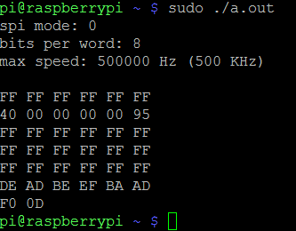
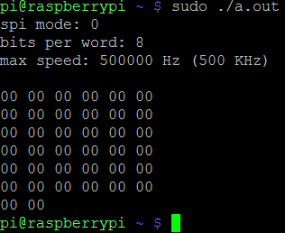

# Начало работы с SPI на Raspberry Pi
http://www.brianhensley.net/2012/07/getting-spi-working-on-raspberry-pi.html  
Сначала включаем **spi** через утилиту `sudo raspi-config`.  
Проверяем наличие интерфейса **spi**: `ls /dev/` - должны увидеть файлы `spidev0.0` и `spidev0.1`.  

Для проверки нужно будет соединить между собой выводы MISO и MOSI. Это GPIO 9 и GPIO 10 на картенке ниже  
  

Теперь скачиваем файл [spidev_test.c](https://github.com/torvalds/linux/blob/master/tools/spi/spidev_test.c) на Raspberry Pi ([тут копия](spidev_test.c)). В этом файле нужно поменять device на "spidev0.0". Потом скомпилить его `gcc spidev_test.c` и запустить `sudo ./a.out`  
Результат если SPI работает:  
  
И результат если SPI не работает:  
  
