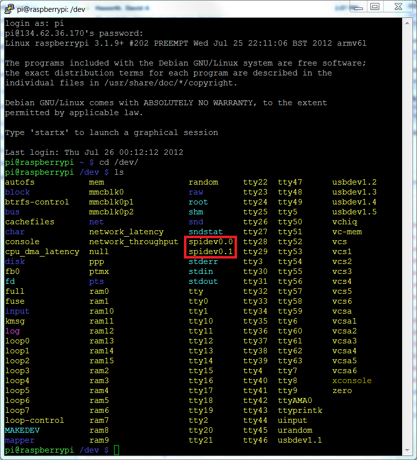

# Начало работы с SPI на Raspberry Pi
http://www.brianhensley.net/2012/07/getting-spi-working-on-raspberry-pi.html  
https://www.raspberrypi.org/documentation/hardware/raspberrypi/spi/README.md  

Сначала включаем **spi** через утилиту `sudo raspi-config`.  
Проверяем наличие интерфейса **spi**: `ls /dev/` - должны увидеть файлы `spidev0.0` и `spidev0.1`.  



Для проверки нужно будет соединять между собой выводы MISO и MOSI. Это GPIO 9 и GPIO 10 на картенке ниже  
  

Теперь выполняем вот эти команды для проверки SPI:  
```bash
$ wget https://raw.githubusercontent.com/raspberrypi/linux/rpi-3.10.y/Documentation/spi/spidev_test.c
$ gcc -o spidev_test spidev_test.c
$ ./spidev_test -D /dev/spidev0.0
```
Результат ожидается такой:
```
spi mode: 0
bits per word: 8
max speed: 500000 Hz (500 KHz)

FF FF FF FF FF FF
40 00 00 00 00 95
FF FF FF FF FF FF
FF FF FF FF FF FF
FF FF FF FF FF FF
DE AD BE EF BA AD
F0 0D
```
Результат если SPI работает:  
  
И результат если SPI не работает:  
  

Если ссылка не работает, то [вот копия этого файла](spidev_test_rpi.c).

> А вообще предлагалось скачать общий для всех линуксов файл [spidev_test.c](https://github.com/torvalds/linux/blob/master/tools/spi/spidev_test.c) ([тут копия](spidev_test_torvalds.c)). Этот файл нужно было скомпилить `gcc spidev_test.c` и запустить вот так:  
> `sudo ./a.out -D /dev/spidev0.0 -v`  
