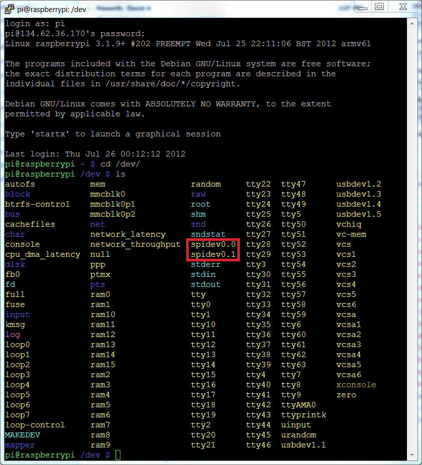

# Начало работы с SPI на Raspberry Pi
http://www.brianhensley.net/2012/07/getting-spi-working-on-raspberry-pi.html  
Сначала включаем **spi** через утилиту `sudo raspi-config`.  
Проверяем наличие интерфейса **spi**: `ls /dev/` - должны увидеть файлы `spidev0.0` и `spidev0.1`.  

Теперь скачиваем файл [spidev_test.c](https://github.com/torvalds/linux/blob/master/tools/spi/spidev_test.c) на Raspberry Pi ([тут копия](spidev_test.c))
