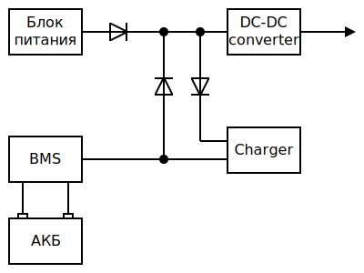

# Блок питания с функцией UPS
Блок питания способен без провалов напряжения переключатся между питанием от сети или аккумулятора. Но главная особенность - это полная зарядка аккумуляторной батареи в относительно короткий период времени без снижения её ресурса.  
Блок питания рассчитан на на использование со свинцово-кислотным AGM аккумулятором. Метод заряда аккумуляторной батареи IUoU.
  
