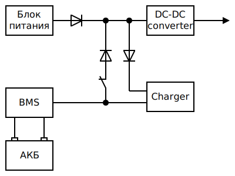

# Источник питания 12V с функцией UPS
Способен без провалов напряжения переключаться между питанием от сети или аккумулятора.  
Но главная особенность - это полная зарядка аккумуляторной батареи в относительно короткий период времени без снижения её ресурса.  

Источник питания рассчитан на использование со свинцово-кислотным AGM аккумулятором.  
Метод заряда аккумуляторной батареи IUoU.  

  

В условиях отключения электроэнергии по графику 4/6, когда 4 часа нет электричества и 6 часов - есть, источник питания способен полностью зарядить аккумулятор за время подачи электроэнергии. Для этого ток, потребляемый устройствами, не должен превышать зарядный ток аккумулятора. А мощности блока питания должно хватать для одновременного питания устройств и заряда аккумулятора. Например: устройства потребляют ток до 1 A, ёмкость аккумулятора 12 Ач, зарядный ток аккумулятора 1.2 А, блок питания рассчитан на ток до 2 А.

### Блок питания
Напряжение от 17V до 28V, ток в 2 раза больше требуемого для питания утройств.  
Причина по напряжению: зарядное устройство заряжает аккумулятор напряжением до 14.8V и ему должно хватить питания для этого. Кроме того, при работе от сети, напряжение блока питания должно превышать напряжение на аккумуляторе даже во время зарядки, чтобы диод закрылся и ток от аккумулятора не поступал на нагрузку.  

Причина по току: после возобновления подачи электроэнергии, блок питания должен будет отдавать ток не только на нагрузку, но и на зарядку аккумулятора. Чтобы аккумулятор зарядился как можно быстрее, зарядное устройство не должно быть ограничено в питании. Если принять, что периоды наличия и отсутствия электроэнергии равны (к примеру, по 4 часа), а ток нагрузки равен току заряда аккумулятора, тогда аккумулятор будет успевать полностью заряжаться и в длительной перспективе не разрядится от работы в циклическом режиме. При этом потери энергии будут перекрыты за счёт того, что нагрузка не потребляет максимальный ток всё время, а также напряжение заряда выше напряжения питания нагрузки.  

В качестве блока питания хорошо подходит Mean Well HDR-30-15 или другие из этой серии на 15V. У них есть возможность регулировки напряжения до 18V, хоть это и снижает максимальный допустимый ток. И это дорого. Также можно использовать блок питания на 19.5V от ноутбука.  

### Понижающий DC-DC преобразователь
Любой модуль импульсного преобразователя, например на базе LM2596S.  
Можно устанавливать несколько DC-DC преобразователей для получения разных напряжений, например 12V и 5V. Или для предотвращения проблем с питанием разных устройств при коротком замыкании цепи питания одного из них (например, для питания камер видеонаблюдения).  

### Зарядное устройство
Модуль на микросхеме CN3768.  
Это основа всего. Именно эта микросхема позволяет заряжать свинцово-кислотные AGM аккумуляторы в правильном режиме по методу IUoU. На Али есть два вида модулей, поисковые фразы для них: CN3768 и DD30CRTA. Первый - большой, дорогой, на красной плате, с радиатором, заявлен ток зарядки до 4А. Второй - намного дешевле, меньше, на зелёной маленькой плате без радиатора, заявлен ток зарядки до 3А.  
На плате модуля необходимо будет перепаять резистор, который задаёт ток зарядки. Соответственно, этим резистором нужно задать ток зарядки 0.7А, 1.2А или другой, согласно ёмкости аккумулятора.

### BMS
Любой от литиевых аккумуляторов. Его задача только в том, чтобы защитить аккумулятор от переразряда. То есть, отключить всё при снижении напряжения на аккумуляторе до 10.8V.  
Именно BMS, никакие "платы защиты от переразряда" с реле не подходят - они сами жрут немалый ток, и продолжают это делать даже после отключения нагрузки. Тем самым могут убить аккумулятор. А хорошая плата BMS во всех режимах потребляет очень мало тока. Но при больших токах нагрузки плата BMS может черезмерно нагреваться. Так что она хорошо подходит для токов 1A...2A, не более.  
Я использовал модуль HX-4S-A01. Он рассчитан на подключение 4-х Li-Ion аккумуляторов 18650, что по напряжениям заряда и разряда как раз подходит для одного свинцово-кислотного AGM аккумулятора. Причём, аккумулятор подключается к крайним клеммам B+ и B-, а промежуточные клеммы B1, B2, B3 можно оставить неподключёнными. Даже резисторный делитель для иммитации 4-х банок ставить нет необходимости.  

### Диоды
Диоды Шоттки с минимальным прямым падением напряжения. Я использовал SS54, ещё и спаивал их по два параллельно. Всё, чтобы поменьше было потерь энергии. Особенно в режиме работы от аккумулятора.  
Назначение диодов. Диод от блока питания - чтобы при работе от батареи, ток не уходил в блок питания. Даже если потери энергии при этом будут незначительными, в блоке питания будет светиться индикатор, создавая ложное впечатление наличия питания от сети. Диод от BMS к DC-DC преобразователю - для предотвращения неконтролируемого заряда аккумулятора повышенным напряжением от блока питания в режиме работы от сети. Диод перед зарядным устройством - для возможности отключения батареи выключателем, так как сама плата зарядки пропускает ток в обратном направлении.

### Выключатель
В случае длительного блекаута, позволяет отключать питание устройств для экономии заряда аккумулятора. Например, можно отключать роутеры на ночь или отключать охранную сигнализацию пока дома есть люди. При этом, в случае подачи сетевого питания, устройства включатся, и аккумулятор будет заряжаться не зависимо от состояния выключателя.  

### Провода
Не забываем использовать провода с большим сечением. Например 18AWG для потребителей и зарядки по 1А. Так как тупо будет собрать такой идеальный источник питания и словить заметное падение напряжения из-за прохождения больших токов по тонким проводам.  

### Схема
Схема на изображении выше - это не просто блок-схема, это уже принципиальная электрическая схема. Прямоугольниками обозначены готовые модульные устройства, которые можно купить на Али или в других интернет-магазинах. Линиями обозначены соединения положительных выводов модулей. Отрицательные выводы всех модулей, кроме АКБ, соединяются все вместе в одну точку, поэтому они не показаны на схеме. Для аккумуляторной батареи показано два соединения, потому что она подключается **только** к плате BMS, клеммы B+ и B-.
